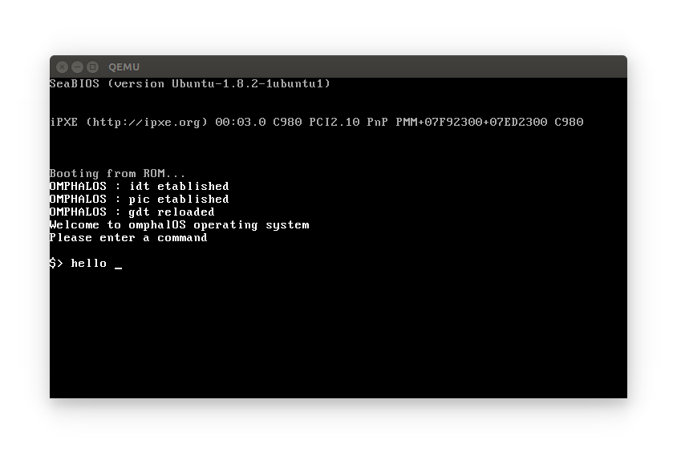

OmphalOS :smiling_imp:
========

## What kind of OS ?

The goal is to build a simple UNIX operating system in C and x86 assembly to better understand how the kernel, qemu, grub... work :yum::mortar_board:

## Result preview

## <i class="icon-file"></i> Bibliography

[:green_book: gitbook - how-to-create-an-operating-system][1]

[:blue_book: Writing a Simple Operating System —
from Scratch][2]

## <i class="icon-file"></i> Useful links
[:link:  8259A PIC Microcontroller
by Mike, 2007][3]

[1]: https://www.gitbook.com/book/samypesse/how-to-create-an-operating-system/details
[2]:https://www.cs.bham.ac.uk/~exr/lectures/opsys/10_11/lectures/os-dev.pdf
[3]: http://www.brokenthorn.com/Resources/OSDevPic.html
